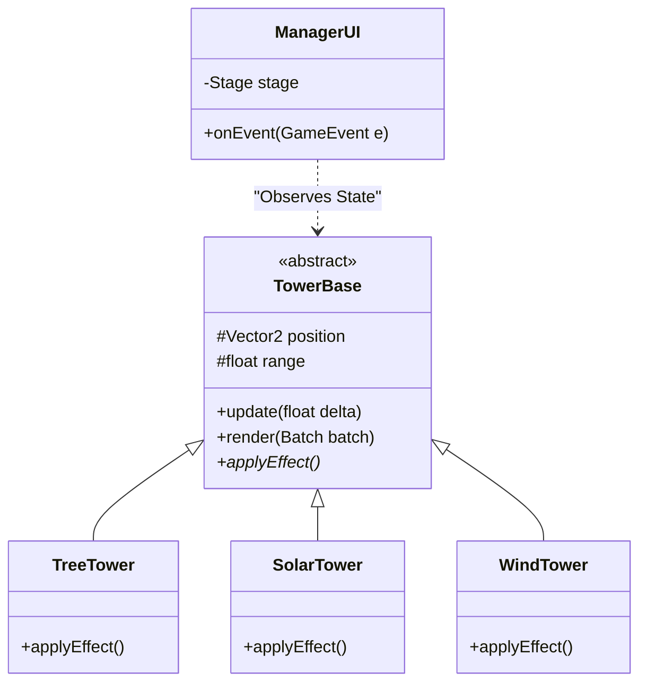

# 🌿 Green Horizon


**Green Horizon** é um motor de estratégia em tempo real (Eco-Strategy/Tower Defense) desenvolvido em Java utilizando o framework LibGDX. O projeto simula um ecossistema urbano onde o jogador deve gerenciar o avanço da poluição através de infraestruturas verdes e energias renováveis.

Este software foi desenvolvido como parte da **APS (Atividade Prática Supervisionada)** acadêmica, focando na aplicação de padrões de projeto, gerenciamento de ciclo de vida de ativos e arquitetura de sistemas desacoplados.

---
# 🎮 Jogue agora!
[Download](https://github.com/matheusmmls/GreenHorizon/releases/download/v1.0.0/GreenHorizon-1.0.0.jar)

---

## 📸 Demonstração

> [!IMPORTANT]


> *Figura 1: Visão geral da renderização de tiles e interface radial.*

---

## 🏗️ Arquitetura e Padrões de Projeto

O software foi projetado seguindo rigorosos princípios de Engenharia de Software para garantir manutenibilidade e performance.

### 1. Polimorfismo e Extensibilidade (`TowerBase`)
A hierarquia de entidades utiliza o princípio de substituição de Liskov através da classe abstrata `TowerBase`. Esta estrutura encapsula o estado compartilhado (coordenadas, dano, alcance) e define contratos de comportamento que permitem ao motor de jogo tratar de forma agnóstica diferentes tipos de torres:
* **Torre de Árvore:** Implementação focada em filtragem de partículas (Dano).
* **Torre Solar:** Especialização para geração de recursos passivos (Economia).
* **Torre Eólica:** Implementação de controle de grupo via algoritmos de redução de velocidade (*Crowd Control/Slow*).

### 2. Desacoplamento via Sistema de Eventos
Para evitar o acoplamento rígido entre a lógica de simulação e a camada de interface (Scene2D), implementou-se um **GameEventManager**. Isso permite que a UI reaja a mudanças de estado (construção, venda, upgrades) sem possuir referências diretas às instâncias das torres, facilitando testes unitários e modularização.

### 3. Gerenciamento de Memória e Assets
Utilização de um `AssetManager` centralizado para controle de referências e contagem de carregamento assíncrono. Os mapas são processados via renderização de matrizes de tiles `.tmx` (Tiled), otimizando o *draw call* do SpriteBatch.

---

## 📊 Diagrama de Classes Simplificado



---

## 🎮 Mecânicas e Simulação

* **Economia Dinâmica:** Algoritmos de progressão para upgrades de nível 1 a 3, balanceando custo-benefício e ROI (Retorno sobre Investimento) em vendas.
* **Pipeline de Waves:** Sistema discreto de estados para controle de ondas progressivas de fumaça/poluição.
* **Renderização Pixel-Perfect:** Viewport base de **320x240** com algoritmos de escalonamento que preservam a integridade dos assets em diferentes resoluções.

---

## 🛠️ Stack Técnica

* **Linguagem:** Java 17+
* **Framework:** LibGDX (LWJGL3 Backend)
* **UI:** Scene2D (Menus radiais e tabelas responsivas)
* **Maps:** Tiled Map Editor (.tmx)
* **Build System:** Gradle

---

## 🚀 Ciclo de Execução e Comandos

O projeto utiliza o Gradle Wrapper para garantir consistência entre ambientes de desenvolvimento.

| Comando | Descrição |
| --- | --- |
| `./gradlew clean` | Remove diretórios de build anteriores. |
| `./gradlew build` | Compila o código fonte e gera os artefatos. |
| `./gradlew lwjgl3:run` | Executa o launcher da aplicação desktop. |
| `./gradlew lwjgl3:jar` | Gera o arquivo executável (.jar) na pasta de builds. |

---

## 📄 Licença e Contexto

Este projeto é um artefato acadêmico desenvolvido para fins de avaliação.

Desenvolvido por: **Matheus Melo & Guilherme Godoy**

Testes e parte Escrita: **Guilherme Gamito**

Instituição: Universidade Paulista - Disciplina de APS.

```

```
